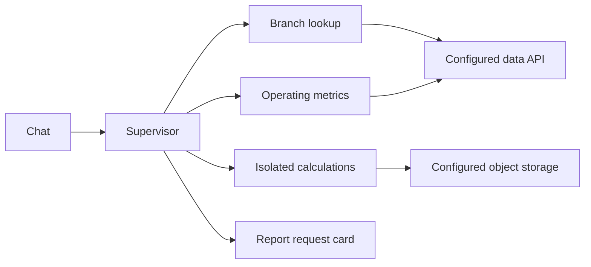

# Business Analytics Agent

A backend portfolio reconstruction for conversational branch and operating-metric analysis. The supervisor delegates to branch lookup, metric-query, isolated calculation/charting, and report-request tools. This project is separate from the wealth research agent because its entities, metric definitions, tools and response contracts differ.

## Try the full-stack business scenario

An operations manager needs the annual revenue contribution of each branch and its year-over-year change. Run the public browser demo with Python 3.11+:

```bash
python3 -m portfolio_demo.server
# Open http://127.0.0.1:8765/
```

The UI selects a reporting year and branch. `GET /api/years` and `GET /api/metrics?year=2025&branch_id=BRANCH003` read the same synthetic records through a local SQLite table with a unique branch/year key and bound query values. The existing `summarize()` business rule calculates total revenue, share and growth. `BRANCH003` contributes 20% in 2025 and has no 2024 baseline, so the UI shows **No baseline** rather than zero growth.

The demo is a new public reconstruction of the frontend → API → SQL → calculation → UI path. It does not call the LLM agent, customer data APIs, report service, Redis, or object storage. The original operations folder included a frontend description but no frontend source. The demo is not represented as the original customer UI.

Run its HTTP and data-boundary tests with `python3 -m unittest discover -s tests -v`. The server binds only to `127.0.0.1` and requires no credentials.



## Offline example

```bash
python demo.py
python -m unittest discover -s tests -v
python scripts/check_privacy.py
```

These commands require only Python 3.11 or newer. Synthetic branch-year records demonstrate revenue totals, shares and year-over-year growth. The calculation rejects duplicate observations and preserves missing baselines and undefined ratios. It is deterministic and does not invoke a language model.

## Backend adaptation

Install `requirements.txt` in a virtual environment and export the variables in `.env.example`. External services are off by default. A live run requires your own model and data APIs, `ENABLE_EXTERNAL_SERVICES=true`, and `DATA_API_PATHS_JSON` matching the names in `config/endpoint_names.json`. API response shapes must match the retained tool adapters. Optional entity preprocessing uses `ENTITY_API_URL` without a global cache of user questions. Optional calculation/chart tools require E2B and object-storage credentials; clients are created lazily.

Run `python main.py` to bind to loopback port 8000. Routes are `/api/conversation/portfolio` and `/api/conversation/portfolio/stream`. The data service must authenticate incoming tokens and enforce record-level authorization. History is opt-in and expires after one hour. Audit writes are disabled and application logs exclude request/response payloads.

The report tool returns a request/card descriptor; it does not generate a Word or PDF file locally. No original frontend source was present in the supplied project; the runnable browser demo above was newly written for this portfolio. Original screenshots, deployment configuration, bulk question runner, private prompts and unused alternative agent code were excluded.

## Verification scope

The offline example, metric tests, browser-demo HTTP tests, configuration tests, syntax checks and privacy-pattern checks are verified and included in CI. A sandbox that prohibits loopback sockets skips only the HTTP tests; repository tests still run. Live LLM/data/Redis/E2B/object-storage behavior is unverified. Dependency pins are inherited from the supplied project rather than a newly resolved environment.
