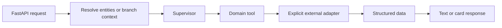

# Architecture and engineering decisions

## One review entry point, four application boundaries

This monorepo provides a single entry point for reviewing related engineering work. Each project has an independent entry point, configuration, README, tests and dependency list. There are no runtime imports between projects. Tests run in separate processes because several original applications use top-level package names such as `config` and `util`.

The two risk-monitor variants share a rule framework and were consolidated. The wealth and business analytics agents retain separate domain tools and API response contracts. Combining them only because both use an LLM would blur those boundaries. The standalone mutex remains useful as a smaller concurrency example; it is not a shared production package.

## Risk monitoring

```mermaid
flowchart LR
    Trigger[CLI or scheduler] --> Date[Normalize business date]
    Date --> Runner[Select rule and dimension]
    Runner --> Source[Check source snapshot]
    Source --> DAO[Fetch domain data]
    DAO --> Rule[Calculate rule result]
    Rule --> Persist[Upsert result and category]
    Persist --> Status[Aggregate success and failures]
    Scheduler[Scheduled invocation] --> Lease[Acquire and renew lease]
    Lease --> Trigger
```

Rule classes own calculations; DAOs own retrieval and persistence. Explicit IDs provide predictable dispatch, with class discovery for extension. Discovery caches classes rather than mutable instances so per-run state is not reused inadvertently. Historical replay uses inclusive date ranges and retains failure counts.

Persistence includes separate MySQL and PostgreSQL upsert paths. The broader domain SQL remains oriented toward MySQL and is not a verified portable SQL layer. Several retained DAOs still need parameterization and integration coverage before production use.

## Agent services

The model interprets requests and selects tools. Deterministic code handles data retrieval contracts and explicit calculations. Wealth queries need product/share-class disambiguation; operations queries need branch scope, period, metric and comparison-group semantics. These are different data contracts.

Original prompts were replaced with generalized instructions. Private audit-service writes are disabled. External services are off by default, and optional history is scoped by user/session with an expiry. Incoming user identifiers are not authorization evidence: real adapters need a trusted authentication and record-level authorization boundary.

The operations report tool returns a report request/card. A document-generation service is not implemented in this repository. Its sandbox integration is optional and is not used by the offline demo.

The new operations browser demo is an independently runnable, standard-library example. Its path is `HTML/JavaScript → GET /api/metrics → SQLite repository → summarize() → JSON → DOM`. A unique `(branch_id, year)` key rejects duplicate observations at storage, parameterized queries constrain data access, and the shared calculation preserves an undefined growth value when a prior-year row is missing. It demonstrates a full-stack business workflow using synthetic data; it does not simulate a live LLM call or customer UI.

## Lease tradeoffs

Both lease examples use conditional updates to claim a job and owner tokens to guard release. The risk monitor adds heartbeat renewal; the standalone MySQL example does not. Neither mechanism establishes exactly-once business execution.

If a process loses its lease but continues writing, token-checked release cannot prevent stale writes. Downstream idempotency and, where needed, fencing are separate requirements. The risk adapter uses application timestamps, so clock skew is another integration consideration. The standalone mutex's two-connection SQLite test covers exclusion and stale release; the risk-monitor suite also exercises the lease with real MySQL and PostgreSQL services.

## Deliberate next steps

1. Extend real database coverage beyond the adapted risk rules and persistence paths.
2. Define and test data-adapter response schemas, authentication and authorization contracts.
3. Replace remaining interpolated domain SQL with bound parameters.
4. Exercise stream cancellation, timeouts and malformed model/tool responses end to end.
5. Resolve and lock live dependencies before measuring latency or throughput.

These are remaining engineering tasks, not capabilities claimed by this portfolio.
