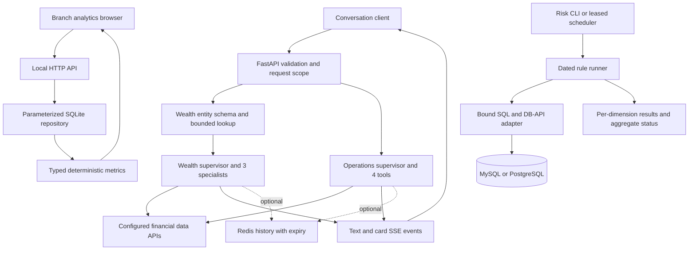

# Engineering revision: evidence and interview guide

This revision strengthens a public reconstruction of financial software work. It does not retroactively attribute portfolio additions or current test results to an internship deployment. The initial findings and ordered plan are in [the audit](ENGINEERING_AUDIT.md); exact execution scope is in [verification](VERIFICATION.md).

## Final architecture

Four independent applications remain in one reviewable repository. They have separate configurations and environments; there are no cross-project runtime imports.



The browser demo and conversational agents are separate runnable paths. There is no implied browser-to-LLM integration. The standalone mutex project provides a smaller lease example.

## Major changes

| Problem | Implemented change | Evidence |
| --- | --- | --- |
| Dynamic filter values could change SQL structure | Converted 43 DAO methods to bound parameters; empty IN lists return no rows | `tests/test_dao_parameters.py` invokes more than 50 actual DAO methods, including already-bound methods |
| Batch inserts committed row by row and relied on dictionary order | One `executemany` transaction, stable columns, validated identifiers | `db/query_adapter.py`, SQLite-backed rollback/order tests |
| Multi-dimension execution hid earlier failures | Return aggregate status and all results while retaining the single-result contract | `tests/test_runner_contract.py` |
| Async-only operations tools broke the synchronous endpoint | Await the real orchestration graph in both response modes | Both `service_tests/test_graph.py` files |
| Model text could be mistaken for a protocol event; card payloads disappeared | Explicit event serialization and opaque text; real card data retained | Both `util/yield_util.py` and API tests |
| Global card state could mix same-ID concurrent requests | Request-local ContextVar storage with guaranteed reset | Wealth boundary concurrency test |
| Model extraction and network failure handling were fragile | Validated entity schema, capped lookup fan-out, transport errors distinct from empty results | Wealth extraction/HTTP code and eight contract fixtures |
| Requests could hang or fail silently | Request/model/HTTP budgets, explicit SSE errors, cancellation propagation, safe error metadata | API timeout/cancellation tests |
| Failed browser requests left stale financial numbers visible | Clear reports, retry, bounded fetch, accessible loading/empty states | Three browser E2E cases |
| No-op utilities and repetitive adapters obscured behavior | Removed unused audit/local HTTP/JSON helpers; consolidated DB-API duplication | Query adapter reduced from 370 to 82 lines without adding a framework |

## Agent engineering decisions

The model selects domain tools; ordinary code enforces schemas, transport status, identity forwarding, numeric rules and event envelopes. Wealth extraction allows at most ten nonempty names and three simultaneous entity lookups. Supervisor/specialist graphs use tool-call and recursion limits; the API has a 45-second total budget and model requests have a 20-second timeout with one retry.

Tool limits are per agent run, not a global cost quota. Sync operations adapters run in worker threads: cancelling the coroutine does not forcibly stop a running HTTP call; the underlying network timeout remains necessary. Redis transactions make append/trim/expiry atomic, but do not serialize concurrent turns in one conversation.

Code execution needs a separate operator-controlled flag in addition to external-service enablement. It is not enabled by model arguments. Optional speech now uses a thread-safe completion event, sends a final frame for short audio, rejects partial transcripts on early close, and closes on timeout. Those provider integrations still require live validation.

Error logs retain request ID and exception type without customer payloads. This is useful diagnostic context, not a distributed tracing or metrics platform.

## Full-stack decisions

The existing plain browser UI remains deliberately small. The server validates year and branch filters, uses bound SQLite queries, and calls a shared typed metric module. Validation rejects duplicate observations, booleans, negative/nonfinite revenue and nonfinite derived values. A missing baseline stays null through the API and becomes “No baseline” in the UI.

A failed request clears the prior report before displaying an error. A retry reloads available years and the newest report. The E2E suite verifies real user-visible state, including mobile layout, rather than testing only helper functions.

## Repository map

```text
business-analytics-agent/
  agent/ tools/ web/       conversational operations service
  metrics.py              validated business calculations
  portfolio_demo/         browser, HTTP and SQLite path
  tests/ service_tests/ e2e/
wealth-agent/
  agent/                  extraction schema and orchestration
  tools/ web/ util/        adapters, API, request state and events
  evals/ service_tests/    contract fixtures and real graph tests
investment-risk-monitor-unified/
  core/ monitors/ dao/ db/
  tests/ adapter_tests/ integration_tests/
database-job-mutex/
scripts/check_all.py
scripts/check_quality.py
.github/workflows/
docs/
```

## Remaining technical debt

1. Production authentication and record-level authorization belong at a trusted boundary; a client-supplied user ID is not identity proof. Default-disabled services and CORS are not authentication.
2. The private financial schemas are absent. Broader inherited SQL remains MySQL-oriented; every financial formula and query is not certified portable or correct by the new parameter tests.
3. Live model routing, grounding, cost and latency need representative labeled tasks and real providers. Eight extraction-contract fixtures are not an accuracy benchmark.
4. Redis needs connection-lifecycle, failure and concurrent-turn integration tests. History is bounded but has no durable conversation ordering protocol.
5. Optional code execution needs deployment-specific network/data policies and live E2B/storage verification. A sandbox is not a complete prompt-injection defense.
6. Leases prevent conflicting ownership but provide neither exactly-once side effects nor fencing of a worker that continues after losing its lease.
7. Larger deployments would need request admission/rate limits, operational metrics and explicit adapter response schemas. Add them when deployment constraints justify them.

## Recruiter-facing evidence

The strongest signals are an inspectable browser-to-SQL business path, real async agent orchestration tests, deterministic validation around LLM output, query parameterization, transaction rollback, and concurrency ownership tests. CI makes these claims checkable. This repo supports a backend-focused full-stack/agent narrative; it does not establish production scale or model-training experience.

## Interview talking points

1. **Missing data versus zero:** why a new branch has undefined growth, how null survives SQL/API/UI, and how tests prevent misleading business results.
2. **SQL binding:** why escaping strings is weaker than bound values; dynamic IN placeholders versus dynamic identifiers; limits of capture tests.
3. **Atomic batches:** how a duplicate key should roll back the entire batch; why stable column ordering matters even with dictionaries.
4. **Async graph bug:** how an async tool failed under synchronous invocation; the difference between API mocks and a real graph with a scripted model.
5. **SSE contracts:** why a model's text must not become an application command, how cards carry data, and how errors are reported after HTTP headers are sent.
6. **Request isolation:** why caller-supplied IDs cannot own shared mutable state, what ContextVar isolates, and how parallel tests reproduce the failure.
7. **Execution budgets:** total versus per-call timeout, cancellation versus thread termination, and per-agent tool limits versus overall token cost.
8. **Reliable evaluation:** what synthetic tool cases, output-contract fixtures and live model evaluations each prove; why the scores cannot be conflated.
9. **Lease limits:** owner-token release, renewal, stale workers, and why fencing/idempotency remain separate requirements.
10. **Scope and attribution:** explain which code came from internship work and which tests/UI/reliability improvements were added for this public reconstruction.

## Defensible resume bullets

These describe the current public repository. If used under an internship, identify post-internship reconstruction work explicitly and verify personal contribution scope.

- Built a browser-to-API-to-SQL analytics workflow for branch revenue, contribution share, and year-over-year growth, preserving missing baselines and validating financial inputs across the application.
- Hardened two domain-agent services with async supervisor/tool execution, validated entity extraction, request-isolated card state, bounded execution, and explicit streaming failure contracts.
- Parameterized 43 financial-monitor DAO methods and consolidated database access into a shared DB-API adapter with atomic batch writes and regression checks for rollback and parameter ordering.
- Added dependency-backed API and orchestration tests, browser E2E checks, and an eight-case extraction-contract harness; configured CI for Python 3.11/3.13, focused static checks, and container health checks.
- Corrected multi-dimension risk-result aggregation so earlier execution failures remain visible, while preserving the single-dimension response contract.
