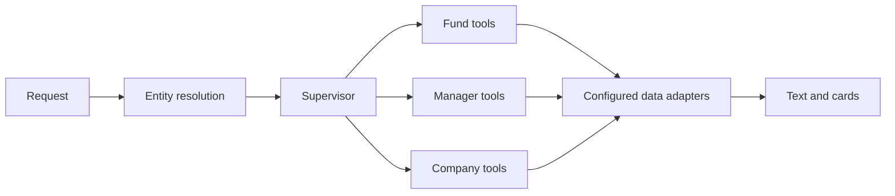

# Wealth Research Agent

A generalized portfolio reconstruction of a financial research assistant. It retains entity resolution, bounded concurrent entity lookup, specialist agents for funds/managers/companies, structured data tools, request-scoped token forwarding, card responses, and streaming chat.

**Business scenario:** a user asks about an incomplete fund name or compares two products when one has no one-year return. The service architecture resolves candidate entities, routes fund/manager/company questions to specialist tools, and streams text or structured cards. The public synthetic cases make ambiguity, partial comparisons and missing history inspectable. They test deterministic tool behavior; live LLM routing and private data adapters are outside this runnable example.



## Run without external services

Python 3.11 or newer is sufficient for the offline example and tests:

```bash
python demo.py
python -m unittest discover -s tests -v
python scripts/check_privacy.py
```

The offline example implements deterministic resolution, screening and comparison against five synthetic funds. It does not run an LLM. Twelve executable synthetic cases cover ambiguity, missing entities, ties, missing history, partial results and unsupported predictions. `evals/coverage_catalog.json` also records 108 generic scenario labels; it contains no original answers, logs or evaluation scores and is not an executed benchmark.

## Adapt the agent service

Install `requirements.txt` into a virtual environment. Export the variables documented in `.env.example`; the application reads the process environment directly. External services are disabled by default. To enable them, set `ENABLE_EXTERNAL_SERVICES=true`, configure the model endpoint/key/model, and supply your own data API base URL and endpoint mapping through `DATA_API_PATHS_JSON`. Set `DATA_API_USER_ID` for legacy adapters that require an explicit user identifier; it is configuration, not proof of authorization. `config/endpoint_names.json` lists adapter names, not working API paths. Set `SEARCH_API_URL` for the optional search integration. The original private backend is not distributed here.

Run `python main.py`. The default bind address is loopback on port 8000. Chat routes are `/api/conversation/wealth` and `/api/conversation/wealth/stream`; inspect `model/ChatBody.py` for the request schema. The incoming token is forwarded to the configured data service, which must authenticate and authorize requests. User-provided IDs are not proof of authorization.

History is disabled by default; enabling `ENABLE_HISTORY=true` uses Redis with a one-hour expiry and a user/session namespace. Original audit-service writes are replaced by no-op adapters, and application payloads are excluded from logs. Customer tools remain extension examples and are not registered with the supervisor.

Optional speech integration requires `requirements-speech.txt`, `ENABLE_SPEECH=true` and the `SPEECH_*` variables. It is not exercised by the offline demo.

## Verification scope

Offline tests and syntax/privacy checks run in the included GitHub Actions workflow. Live LLM, speech, Redis and customer API integration have not been tested in this environment. The inherited dependency pins are starting points from the supplied code, not a newly resolved lockfile. Prompts and examples were rewritten for this portfolio; original production performance is not claimed.
